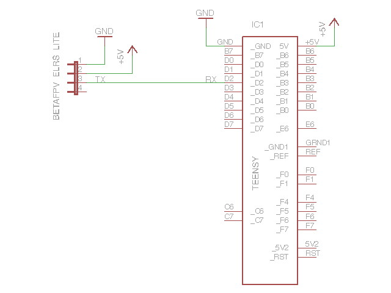

# ELRS Receiver

[ExpressLRS](https://www.expresslrs.org/) added S.BUS support back into their receiver firmware in version 3.3 (and newer). Using S.BUS it is possible to hook up an ELRS receiver to the S.BUS gamepad. The amazing thing is not only did the ELRS developers add S.BUS to their receiver firmware but they also added Inverted S.BUS. Inverted S.BUS makes the transistor inverter redundant (no more extra hardware). Shout-out to [Roberto](https://github.com/RobertoD91) who let me know about this.

**A word of caution:** Hooking up an ELRS receiver directly to the Teensy mixes a 5 Volt system (Teensy) with a 3.3 Volt system (ELRS receiver). Be carefull **not** to connect any 5 Volt outputs to a 3.3 Volt input (e.g. do not connect the Teensy UART TX to the ELRS receivers RX). The ESP controllers used in most ELRS receivers are **not** 5 Volt tolerant. Connecting the ELRS receivers TX output to the Teensy RX input should be ok though. The Teensy needs a signal of at least 0.6 * VCC = 3V to recognize a high value.

Since there is no serial passthrough in the S.BUS gamepad firmware I found it easiest to use Wifi to upgrade the receiver firmware. If you e.g. enable AUTO_WIFI_ON_INTERVAL in the ExpressLRS Configurator the ELRS receiver will start Wifi after a default 60 seconds if no transmitter connects.

For all other ELRS receiver settings I used the ELRS LUA script on my transmitter. Here you can e.g. change the receiver protocol from CRSF to Inverted S.BUS or set the default behavior for a fail-safe.

Date: 2023-11-17

