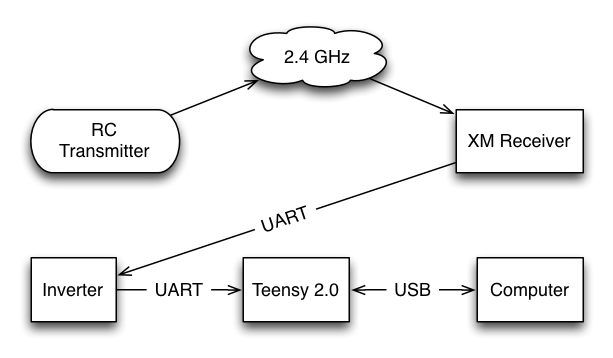
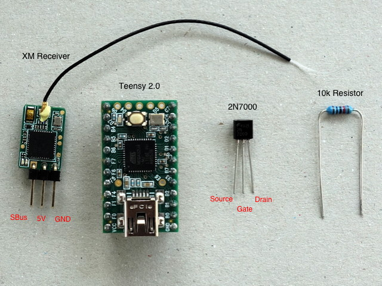

# Hardware

Here is the diagram of the setup:

Below you can see the schematics of the hardware:

This is the parts list:

And you can easily plug the hardware using a breadboard:

Date: 2018-09-23
