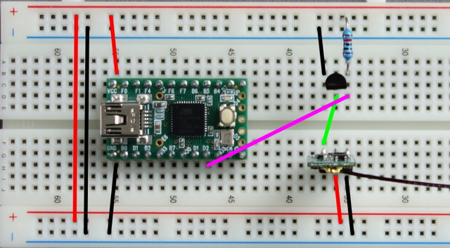

# Hardware

Below you can see the schematics of the hardware needed. I first used a NPN transistor instead of the MOSFET as the inverter. But I soon discovered that the edges of the signal generated by the transistor where not good enough for the Teensy to read. The advantage of using a MOSFET is also that it helps you save one additional resistor at the base/gate.

You can easily plug the hardware together using a breadboard. The pinout of the 2N7000 looking at the flat front is source, gate, drain (from left to right). And the pinout of the XM receiver looking at the front with the bind button and LED (antenna up) is sbus signal, 5 volts, Ground (also from left to right).

Date: 2018-09-23
