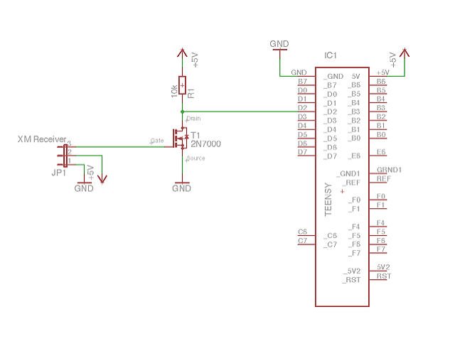

# Hardware

Below you can see the schematic of the hardware. I initially used a NPN transistor as the inverter. But I soon discovered that the signal generated by the transistor was not good enough for the Teensy to read. Using a MOSFET also helps you save one additional resistor at the base/gate.

This is the parts list:

And for testing you can easily plug the hardware using a breadboard:

Date: 2018-09-23
