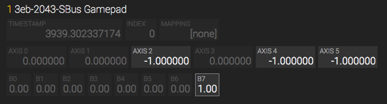

# Testing

All testing was done using a Teensy 2.0 and the 16 channel FrSky XM receiver (no other hardware was used).

A nice way to check the S.BUS gamepad values is the [HTML5 Gamepad Tester](http://html5gamepad.com/). Values should toogle between -1 and 1 for the analog inputs. On my computer the two sliders (channel 7 & 8) where not displayed.



Shoud you need to adjust the range of the S.BUS values sent by your transmitter please edit the X1, X2 macros in the SBus.h file and rebuild. Remember to calibrate your transmitter first.

Be aware that depending on the firmware the XM receiver sends the **R**adio **S**ignal **S**trength **I**ndicator (RSSI) in channel 16 to the Teensy. Because of this the last button (B7) is "on".

Right now the gamepad is configured to work with the D16 XM receiver (16 channels). In the future there might be 24 or even 32 channel receivers. If you would like to adjust the gamepad firmware to a receiver like that take a look at the `CH_BUFFER_OCTETS` macro in the SBus.h file. I'm not sure if the timing will work but the buffer sizes should adjust accordingly.  

The Teensy needs to run with 5 Volts to be a full speed USB device. Also the FrSky XM receiver needs the 5 Volts to operate (output of the S.BUS signal is 3.3 Volts though). Total power consumption should be around 50 mA at 5 Volts (30 mA for the Teensy and 20 mA for the XM receiver).

Memory usage currently does not seem to be an issue. It might even be possible to fit this firmware into an atmega8u2 (8k flash, 512 bytes RAM):

```
AVR Memory Usage
----------------
Device: atmega32u4

Program:    7008 bytes (21.4% Full)
(.text + .data + .bootloader)

Data:         96 bytes (3.8% Full)
(.data + .bss + .noinit)
```

Sometimes I experience receiver fail-safes while using the S.BUS gamepad. This probably happens because receiver and transmitter are so close together (just like when you try to bind and it does not work). I have enabled receiver fail-safes in the transmitter and set default positions in the XM receiver by pushing the bind button for less than a second (green LED flashes twice). Now I can watch my quad fall out of the sky in FPVFreerider just like in real life ;-) .

Date: 2018-09-22

