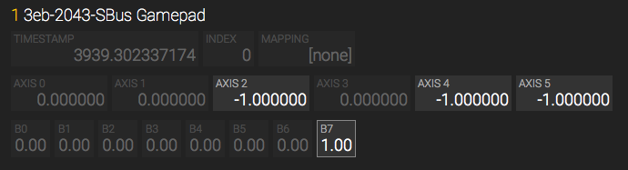

# Testing

All testing was done using a Teensy 2.0 and the 16 channel FrSky XM receiver (no other hardware was used).

A nice way to check the values the sbus gamepad provides is the [HTML5 Gamepad Tester](http://html5gamepad.com/). Values should toogle between -1 and 1 for the analog inputs. On my computer the sliders where not displayed by HTML5 Gamepad.

Shoud you need to adjust the range of the sbus values sent by your transmitter please edit the X1, X2 macros in the SBus.h file and rebuild.

Be aware that the XM receiver sends the **R**adio **S**ignal **S**trength **I**ndicator (RSSI) in channel 16 to the Teensy. Because of this the last button (B7) is usually "on".

The Teensy needs to run with 5 volts to be a full speed USB device. Also the FrSky XM receiver needs the 5 volts to operate (output of the sbus signal is 3.3 volts though). Total power consumption should be around 50 ma at 5 volts (30 ma for the Teensy and 20 ma for the XM receiver).

Date: 2018-09-22

